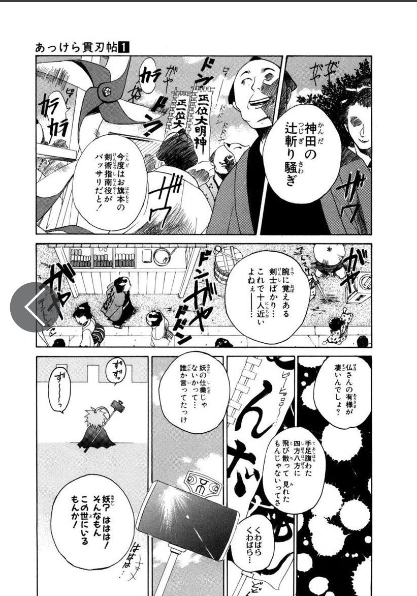

# Manga Text Bubble Detector to Translate
This is a repository for a deep learning model that can detect text bubbles in manga and feed them into a translator.

### Work Flow
1. single manga page =>
2. text bubble detector to crop text bubbles =>
3. optical character recognition engine to extract text from bubbles (tesseract OCR) => 
4. google translate API

**Note**: The text bubble detector is a UNet with depthwise/transpose convlutional layers, trained with personal dataset and [Manga109](http://www.manga109.org/en/).

The text bubble detector is effective while the OCR is not effective (especially for vertical Japanese). Therefore, the translation result is not good.

### Testing Results

#### Original Manga Pages
 

#### Predicted Masks
 

#### Convert to Contour Bounding Boxes
   

#### Extract Bubble Boxes One by One, and Translate after Superresolution

### Requirements
For bubble detection: matplotlib==3.3.0, numpy==1.18.5, opencv_python_headless==4.5.4.58, Pillow==9.4.0,tensorflow==2.11.0

For translation: pytesseract==0.3.8, googletrans==4.0.0rc1

### How to Use
You can see some example outputs in _exds/v4_13600/_
1. clear the folder _exds/v4_13600/_
2. put the manga pages (better single pages in resolution 250x750) you want to translate into the folder.
3. **python3 word_detect.py** to generate text bubbles, or **python3 word_detect_and_translate.py** to generate text bubbles and translate

### Files for Training
* **preproc.py**: data preprocessing for dataset labelled with white-balck mask
* **preproc_xml.py**: data preprocessing for dataset labelled with xml (like Manga109)
* **detect_bubble_xml_2.py**: file to construct and train models
